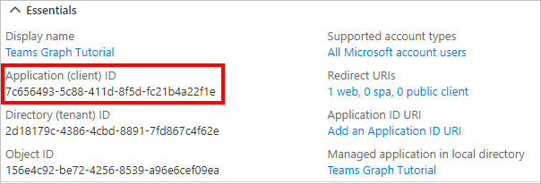

<!-- markdownlint-disable MD002 MD041 -->

В этом упражнении вы создайте регистрацию нового веб-приложения Azure AD с помощью Центра администрирования Azure Active Directory.In this exercise, you will create a new Azure AD web application registration using the Azure Active Directory admin center.

1. Откройте браузер и перейдите к [Центру администрирования Azure Active Directory](https://aad.portal.azure.com).Open a browser and navigate to the [Azure Active Directory admin center](https://aad.portal.azure.com). Войдите с помощью **личной учетной записи** (т.е. учетной записи Microsoft) или **рабочей (учебной) учетной записи**.Login using a **personal account** (aka: Microsoft Account) or **Work or School Account**.

1. Выберите **Azure Active Directory** на панели навигации слева, затем выберите **Регистрация приложений** в разделе **Управление**.Select **Azure Active Directory** in the left-hand navigation, then select **App registrations** under **Manage**.

    

1. Выберите **Новая регистрация**.Select **New registration**. На странице **"Регистрация приложения"** задайте значения следующим образом, где находится URL-адрес переадстройки ngrok, скопированный в `YOUR_NGROK_URL` предыдущем разделе.On the **Register an application** page, set the values as follows, where `YOUR_NGROK_URL` is the ngrok forwarding URL you copied in the previous section.

    - Введите **имя** `Teams Graph Tutorial`.Set **Name** to `Teams Graph Tutorial`.
    - Введите **поддерживаемые типы учетных записей** для **учетных записей в любом каталоге организаций и личных учетных записей Microsoft**.Set **Supported account types** to **Accounts in any organizational directory and personal Microsoft accounts**.
    - В разделе **URI адрес перенаправления** введите значение в первом раскрывающемся списке `Web` и задайте значение `YOUR_NGROK_URL/authcomplete`.Under **Redirect URI**, set the first drop-down to `Web` and set the value to `YOUR_NGROK_URL/authcomplete`.

    

1. Нажмите **Зарегистрировать**.Select **Register**. На странице **"Руководство по Teams Graph"** скопируйте значение ИД приложения **(клиента)** и сохраните его, оно потребуется вам на следующем этапе.On the **Teams Graph Tutorial** page, copy the value of the **Application (client) ID** and save it, you will need it in the next step.

    

1. Выберите **Проверка подлинности** в разделе **Управление**.Select **Authentication** under **Manage**. Найдите **раздел неявного предоставления** и в включить **маркеры доступа** и **маркеры ID.**Locate the **Implicit grant** section and enable **Access tokens** and **ID tokens**. Нажмите **Сохранить**.Select **Save**.

1. Выберите **Сертификаты и секреты** в разделе **Управление**.Select **Certificates & secrets** under **Manage**. Нажмите кнопку **Новый секрет клиента**.Select the **New client secret** button. Введите значение  в описании, выберите один из параметров "Срок действия **истекает"** и выберите **"Добавить".**Enter a value in **Description** and select one of the options for **Expires** and select **Add**.

1. Скопируйте значение секрета клиента, а затем покиньте эту страницу.Copy the client secret value before you leave this page. Оно вам понадобится на следующем шаге.You will need it in the next step.

    > [!IMPORTANT]
    > Это секрет клиента, он никогда не отображается еще раз, поэтому убедитесь, что вы скопировали его.This client secret is never shown again, so make sure you copy it now.

1. Выберите **разрешения API в** области **"Управление",** а затем **выберите "Добавить разрешение".**Select **API permissions** under **Manage**, then select **Add a permission**.

1. Выберите **Microsoft Graph,** а затем **делегирование разрешений.**Select **Microsoft Graph**, then **Delegated permissions**.

1. Выберите следующие разрешения, а затем выберите **"Добавить разрешения".**Select the following permissions, then select **Add permissions**.

    - **Calendars.ReadWrite** — позволяет приложению читать и записывать данные в календарь пользователя.**Calendars.ReadWrite** - this will allow the app to read and write to the user's calendar.
    - **MailboxSettings.Read** — позволяет приложению получать часовой пояс, формат даты и формат времени пользователя из параметров почтового ящика.**MailboxSettings.Read** - this will allow the app to get the user's time zone, date format, and time format from their mailbox settings.

    

## Настройка единого входов в TeamsConfigure Teams single sign-on

В этом разделе вы обновим регистрацию приложения, чтобы поддерживать единый вход [в Teams.](/microsoftteams/platform/tabs/how-to/authentication/auth-aad-sso)In this section you'll update the app registration to support [single sign-on in Teams](/microsoftteams/platform/tabs/how-to/authentication/auth-aad-sso).

1. Выберите **"Показать API"**.Select **Expose an API**. Выберите **ссылку "Установить"** рядом с **URI ИД приложения.**Select the **Set** link next to **Application ID URI**. Вставьте доменное имя URL-адреса переадружения ngrok (с косой чертой "/" в конце) между двойной косой чертой и GUID.Insert your ngrok forwarding URL domain name (with a forward slash "/" appended to the end) between the double forward slashes and the GUID. Весь ИД должен выглядеть примерно так: `api://50153897dd4d.ngrok.io/ae7d8088-3422-4c8c-a351-6ded0f21d615` .The entire ID should look similar to: `api://50153897dd4d.ngrok.io/ae7d8088-3422-4c8c-a351-6ded0f21d615`.

1. В разделе **"Области", определяемом этим API,** выберите **"Добавить область".**In the **Scopes defined by this API** section, select **Add a scope**. Заполните поля следующим образом и выберите **"Добавить область".**Fill in the fields as follows and select **Add scope**.

    - **Имя области:**`access_as_user`**Scope name:** `access_as_user`
    - **Кто может дать согласие?: администраторы и пользователи****Who can consent?: Admins and users**
    - **Отображаемая имя согласия администратора:**`Access the app as the user`**Admin consent display name:** `Access the app as the user`
    - **Описание согласия администратора:**`Allows Teams to call the app's web APIs as the current user.`**Admin consent description:** `Allows Teams to call the app's web APIs as the current user.`
    - **Отображаемая имя согласия пользователя:**`Access the app as you`**User consent display name:** `Access the app as you`
    - **Описание согласия пользователя:**`Allows Teams to call the app's web APIs as you.`**User consent description:** `Allows Teams to call the app's web APIs as you.`
    - **Состояние: включено****State: Enabled**

    

1. В разделе **"Авторизованные клиентские приложения"** выберите **"Добавить клиентские приложения".**In the **Authorized client applications** section, select **Add a client application**. Введите ИД клиента из следующего списка, введите область в разрешенных разрешениях и выберите **"Добавить приложение".**Enter a client ID from the following list, enable the scope under **Authorized scopes**, and select **Add application**. Повторите этот процесс для каждого из клиентских ИД в списке.Repeat this process for each of the client IDs in the list.

    - `1fec8e78-bce4-4aaf-ab1b-5451cc387264` (Мобильное или настольное приложение Teams)`1fec8e78-bce4-4aaf-ab1b-5451cc387264` (Teams mobile/desktop application)
    - `5e3ce6c0-2b1f-4285-8d4b-75ee78787346` (Веб-приложение Teams)`5e3ce6c0-2b1f-4285-8d4b-75ee78787346` (Teams web application)
