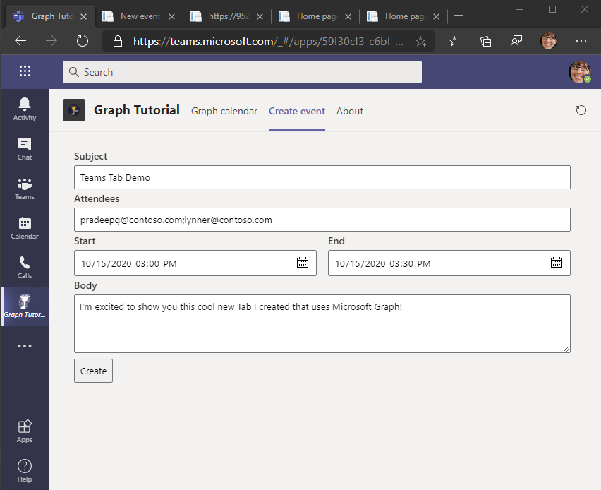

<!-- markdownlint-disable MD002 MD041 -->

<span data-ttu-id="aa6cb-101">В этом разделе вы добавим возможность создания событий в календаре пользователя.</span><span class="sxs-lookup"><span data-stu-id="aa6cb-101">In this section you will add the ability to create events on the user's calendar.</span></span>

## <a name="create-the-new-event-tab"></a><span data-ttu-id="aa6cb-102">Создание новой вкладки события</span><span class="sxs-lookup"><span data-stu-id="aa6cb-102">Create the new event tab</span></span>

1. <span data-ttu-id="aa6cb-103">Создайте файл **в каталоге ./Pages** с именем **NewEvent.cshtml** и добавьте следующий код.</span><span class="sxs-lookup"><span data-stu-id="aa6cb-103">Create a new file in the **./Pages** directory named **NewEvent.cshtml** and add the following code.</span></span>

    :::code language="razor" source="../demo/GraphTutorial/Pages/NewEvent.cshtml":::

    <span data-ttu-id="aa6cb-104">Это реализует простую форму и добавляет JavaScript для публикации данных формы в веб-API.</span><span class="sxs-lookup"><span data-stu-id="aa6cb-104">This implements a simple form, and adds JavaScript to post the form data to the Web API.</span></span>

## <a name="implement-the-web-api"></a><span data-ttu-id="aa6cb-105">Реализация веб-API</span><span class="sxs-lookup"><span data-stu-id="aa6cb-105">Implement the Web API</span></span>

1. <span data-ttu-id="aa6cb-106">Создайте каталог с именем **Models** в корневой каталог проекта.</span><span class="sxs-lookup"><span data-stu-id="aa6cb-106">Create a new directory named **Models** in the root of the project.</span></span>

1. <span data-ttu-id="aa6cb-107">Создайте новый файл в **каталоге ./Models** **с именем NewEvent.cs** и добавьте следующий код.</span><span class="sxs-lookup"><span data-stu-id="aa6cb-107">Create a new file in the **./Models** directory named **NewEvent.cs** and add the following code.</span></span>

    :::code language="csharp" source="../demo/GraphTutorial/Models/NewEvent.cs" id="NewEventSnippet":::

1. <span data-ttu-id="aa6cb-108">Откройте **файл ./Controllers/CalendarController.cs** и добавьте следующую строку в `using` верхней части файла.</span><span class="sxs-lookup"><span data-stu-id="aa6cb-108">Open **./Controllers/CalendarController.cs** and add the following `using` statement at the top of the file.</span></span>

    ```csharp
    using GraphTutorial.Models;
    ```

1. <span data-ttu-id="aa6cb-109">Добавьте в класс **CalendarController** следующую функцию.</span><span class="sxs-lookup"><span data-stu-id="aa6cb-109">Add the following function to the **CalendarController** class.</span></span>

    :::code language="csharp" source="../demo/GraphTutorial/Controllers/CalendarController.cs" id="PostSnippet":::

    <span data-ttu-id="aa6cb-110">Это позволяет http POST веб-API с полями формы.</span><span class="sxs-lookup"><span data-stu-id="aa6cb-110">This allows an HTTP POST to the Web API with the fields of the form.</span></span>

1. <span data-ttu-id="aa6cb-111">Сохраните все изменения и перезапустите приложение.</span><span class="sxs-lookup"><span data-stu-id="aa6cb-111">Save all of your changes and restart the application.</span></span> <span data-ttu-id="aa6cb-112">Обновите приложение в Microsoft Teams и выберите вкладку **"Создать событие".** Заполните форму и выберите **"Создать",** чтобы добавить событие в календарь пользователя.</span><span class="sxs-lookup"><span data-stu-id="aa6cb-112">Refresh the app in Microsoft Teams, and select the **Create event** tab. Fill out the form and select **Create** to add an event to the user's calendar.</span></span>

    
